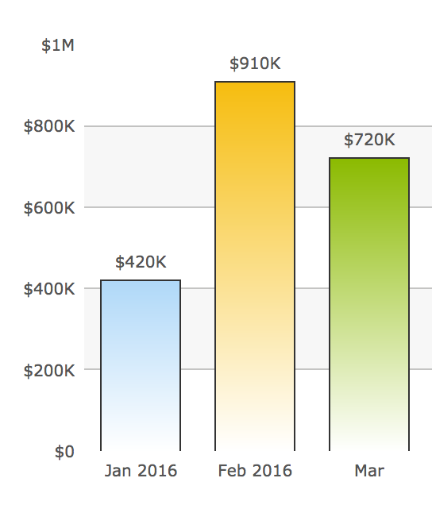
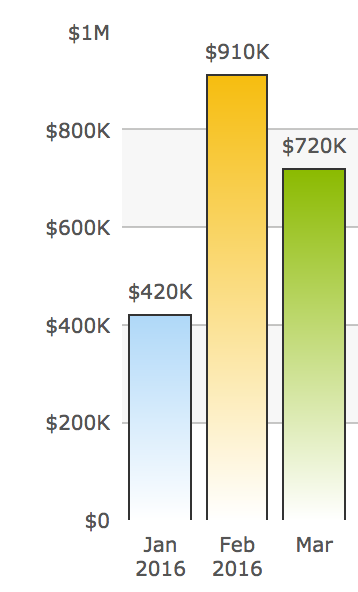
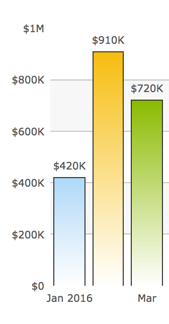

# SmartLabel [](https://travis-ci.org/fusioncharts/fusioncharts-smartlabel) [](https://coveralls.io/github/fusioncharts/fusioncharts-smartlabel?branch=develop)

SmartLabel is a component which can be used to measure and restrict text in svg / canvas where the layout engine does not automatically takes care of the text behaviours.


## Concept

Live demo: [fusioncharts.github.io/fusioncharts-smartlabel](http://fusioncharts.github.io/fusioncharts-smartlabel/)

To build the examples locally, run:

```javascript
npm install
npm start
```

Then open [`localhost:8000`](http://localhost:8000) in a browser.


## Installation

The easiest way to use fusioncharts-smartlabel is to install it from NPM and include it in your own build process (using [Browserify](http://browserify.org), [Webpack](http://webpack.github.io/), etc).

You can also use the standalone build by including `dist/fusioncharts-smartlabel.js`

```javascript
npm install fusioncharts-smartlabel --save
```


## API

__Please see the concept above before proceeding__


SmartLabel is immensely useful when text needs to be drawn in SVG or Canvas. Since SVG / Canvas does not manage text, it is necessary to have pre procressing on the text before getting it rendered.

SmartLabel provides out of the box features to
- If a bound box is provided it wraps / truncates the text
- Calculate the metrics (height and width) of text for any style
- Add ellipses if the text is truncated
- Wraps a label in the bound box


To Create a new instance
```javascript
import SmartLabel from 'fusioncharts-smartlabel'
/*
 * Create new instance of SmartLabel.
 *
 * SmartLabel controls the lifetime of the execution space where the text's metrics will be calculated.
 * This takes a string for a given style and returns the height, width.
 * If a bound box is defined it wraps the text and returns the wrapped height and width.
 * It allows to append ellipsis at the end if the text is truncated.
 *
 * @param {String | HTMLElement} container - The id or the instance of the container where the intermediate dom
 *                              elements are to be attached. If not passed, it appends in body.
 *
 * @param {Boolean} useEllipses - This decides if a ellipses to be appended if the text is truncated.
 * @param {Object} options - Control options
 *                          {
 *                              maxCacheLimit: No of letter to be cached. Default: 500.
 *                          }
 * @constructor
 */
var sl =  new SmartLabel(container, useEllipses, options)
```

To apply style before calculating text metrics
```javascript
/*
 * Sets the style based on which the text's metrics to be calculated.
 *
 * @param {Object} style - The style object which affects the text size
 *                      {
 *                          fontSize / 'font-size' : MUST BE FOLLOWED BY PX (10px, 11px)
 *                          fontFamily / 'font-family'
 *                          fontWeight / 'font-weight'
 *                          fontStyle / 'font-style'
 *                      }
 *
 * @return {SmartLabel} - Current instance of SmartLabel
 */
sl.setStyle(style);
```

Decide whether the text would have trailing ellipses if truncated
```javascript
/*
 * Decides whether ellipses to be shown if the node is truncated
 *
 * @param {Boolean} useEllipses - decides if a ellipses to be appended if the text is truncated. Default: false
 *
 * @return {SmartLabel} - Current instance of SmartLabel
 */
sl.useEllipsesOnOverflow(useEllipses);
```

To get the text bounded by a bound box
```javascript
/*
 * Get wrapped or truncated text if a bound box is defined around it. The result text would be separated by <br/>
 * if wrapped
 *
 * @param {String} text - the subject text
 * @param {Number} maxWidth - width in px of the the bound box
 * @param {Number} maxHeight - height in px of the the bound box
 * @param {Boolean} noWrap - whether the text not to be wrapped. Default false i.e. by default wrapping is enabled.
 *
 * @return {Object} - The metrics of the text bounded by the box
 *                  {
 *                      height : height of the wrapped text
 *                      width : width of the wrapped text
 *                      isTruncated : whether the text is truncated
 *                      maxHeight : Maximum height given
 *                      maxWidth : Maximum width given
 *                      oriText : Original text sent
 *                      oriTextHeight : Original text height
 *                      oriTextWidth : Original text width
 *                      text : SMART TEXT
 *                  }
 */
smartlabel = sl.getSmartText(text, maxWidth, maxHeight, noWrap);
```

To get the lines for a truncated text
```javascript
/*
 * getSmartText returns the text separated by <br/> whenever a break is necessary. This is to recgonize one
 * generalized format independent of the implementation (html5 based solution, canvas based solution, svg based solution).
 * This method converts the output of getSmartText().text to array of lines if the text is wrapped. It sets a named property
 * `lines` on the object passed as parameter.
 *
 * @param {Object} smartlabel - the object returned by getSmartText based on which line arr which to be formed.
 *
 * @return {Object} - The same object which was passed in the arguments. Also a named property `lines` is set.
 */
 smartlabel = sl.getSmartText(text, maxWidth, maxHeight, noWrap);
 generalizedSmartlabel = SmartLabel.textToLines(smartlabel);
```

To get the size of a given text
```javascript
/*
 * Get the height and width of a text.
 *
 * @param {String} text - Text whose metrics to be measured
 * @param {Boolean} Optional detailedCalculationFlag - this flag if set it calculates per letter position
 *                          information and returns it. Ideally you dont need it unless you want to post process the
 *                          string. And its an EXPENSIVE OPERATION.
 *
 * @return {Object} - If detailedCalculationFlag is set to true the returned object would be
 *                  {``
 *                      height: height of the text
 *                      width: width of the text
 *                      detailObj: detail calculation of letters in the format {lettername: width}
 *                  }
 *                  If detailedCalculationFlag is set to false the returned object wont have the detailObj prop.
 */
size = sl.getSize(text, detailedCalculationFlag);
```

To dispose the components
```javascript
/*
 * Dispose the container and object allocated by the smartlabel
 */
sl.dispose();
```

## Usage

A visualization library requires to restrict a text in a bound box to eliminate over lapping. The use case of the application of SmartLabel is huge, however we are taking a small subset of the universal set.

For a typical column chart the labels in X axis conveys category information. It's important to display the labels properly in the visualization. But there are many parameters which affect the label placement.
If the chart is displayed in a space which is large enough to accommodate all the labels, then it is desired to place all the labels in one line


If the space is not enough to place all the labels side by side, it's required to wrap or truncate it.


It's some time desired to skip the labels as well if the category is continuous (Like month of the years)


All this can be eaisly done using SmartLabel.

Following is the example of how a text is constrained by a bound box.
```javascript
// Set the vertical alignment on already created text node
text
	.attr('dy', ".35em");

// Let smartlabel know ellipses is required if the text is truncated.
// Get the text restricted by a bound box which has 100px width and 200px height
smarttext = this.smartlabel
	.useEllipsesOnOverflow(true)
	.getSmartText('Lorem ipsum dolor sit amet, consectetur adipiscing elit, sed do eiusmod tempor incididun', 100, 200);

// Get all the lines in an array. SmartLabel injects <br/> whereever a wrap is required, this conversion is necessary.
normalizedSL = SmartLabel.textToLines(smarttext);

// Create tspan. For more than one line create more than one tspan
tspan = text
	.selectAll('tspan')
	.data(smarttext.lines);

// Perform data joining operations of d3 on the tspans
tspan
	.enter()
		.append('tspan')
	.merge(tspan)
		.attr("dy", normalizedSL.oriTextHeight)
		.attr("x", 0)
		.text(d => d);

```

## License

__MIT__

Copyright (c) 2016 FusionCharts, Inc.  &lt;support@fusioncharts.com&gt;.
